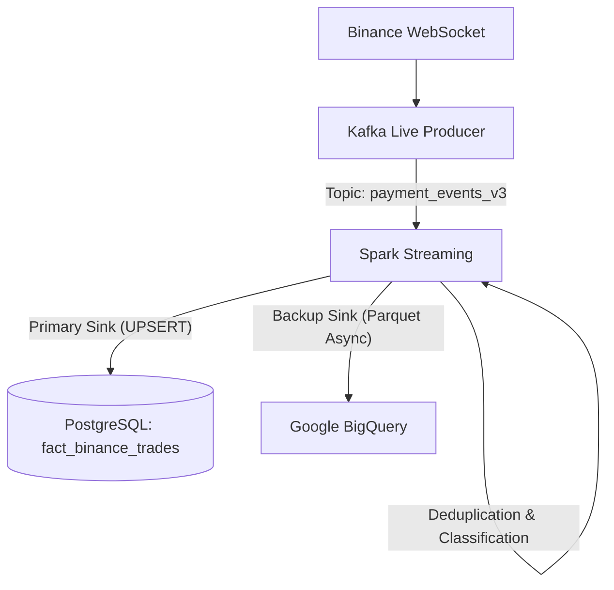

# Real-time Crypto Data Pipeline: Binance Trade Analysis and Anomaly Detection

This project implements a real-time data pipeline for cryptocurrency data, focusing on processing live trade streams from the Binance WebSocket, idempotent deduplication, volume classification (Retail, Whale, etc.), and dual-sink storage to PostgreSQL and BigQuery.

---

## Architecture

The system follows a **Lambda Architecture** design (focused on the Speed Layer) with the following components:

1.  **Data Source (Binance WebSocket)**: Collects free real-time data from Binance (pairs: BTCUSDT, ETHUSDT, BNBUSDT, SOLUSDT, XRPUSDT).
2.  **Message Broker**: **Apache Kafka** acts as the buffer layer for streaming data. The `live_producer.py` script fetches WebSocket data, reformats the payload, and pushes it to the Kafka topic `payment_events_v3`.
3.  **Stream Processing**: **Apache Spark Structured Streaming** (`spark_processor.py`) performs:
    *   **Natural Deduplication**: Based on `transaction_id` (generated as UUID from the original `trade_id`) and a 5-minute `Watermark`.
    *   **Dual Sink Writing**: Pushes data simultaneously to two data warehouses.
4.  **Data Warehouse (PostgreSQL)**: **PostgreSQL** is the Primary Sink, storing real-time data into the `fact_binance_trades` table using UPSERT (ON CONFLICT DO UPDATE).
5.  **Backup Sink (Google BigQuery)**: Stores batches in Parquet format via an asynchronous mechanism and auto-loads them to **Google BigQuery**.



---

## Key Features

*   **Idempotent Deduplication**: The Binance WebSocket may replay trades on reconnect. To handle this, `transaction_id` is generated deterministically using UUID5 from the original `trade_id`. Combined with Spark's `withWatermark` and `dropDuplicates`, the system completely eliminates duplicate data without relying on mock data.
*   **Volume Classification and Anomaly Detection**: Automatically classifies trade volume: `< $10k` (RETAIL), `> $10k` (PROFESSIONAL), `> $100k` (INSTITUTIONAL), and `> $1M` (WHALE). Flags `is_anomaly = True` for whale-sized orders.
*   **PySpark Optimisation on Windows**: Resolved common issues when running PySpark locally on Windows (`Winutils`, `SPARK_LOCAL_IP` configuration, memory allocation, `BlockManagerId NullPointerException`).
*   **Dual-Sink Asynchronous**: Spark writes at high speed in `foreachBatch`. The main thread (synchronous) performs UPSERT to PostgreSQL via JDBC, while a background thread (asynchronous) collects data into Parquet format and uploads sequentially to BigQuery, so checkpoint latency is not affected.

---

## Data Model

The system currently stores the crypto fact streaming data at:
*   **Fact Table**: `fact_binance_trades`
    - Main fields: `transaction_id` (PK, auto-generated UUID), `trade_id`, `crypto_symbol`, `price`, `quantity`, `amount_usd`, `is_buyer_maker`, `volume_category`, `is_anomaly`.
    - Pre-computed dimension keys `date_key` and `time_key` to support dashboard queries.

---

## How to Run the System

### 1. Start infrastructure
Requires Docker Desktop to be running. Start Kafka, Zookeeper, and PostgreSQL (if applicable):
```powershell
make start-kafka
```

### 2. Configure Database
Set up the schema (Star Schema / Fact tables) in the Database:
```powershell
make setup-pg    # Setup for PostgreSQL
make setup-bq    # Setup for BigQuery (if API Keys are configured)
```

### 3. Run Pipeline (Live Mode)
Open 2 Terminals to monitor data flowing through the pipeline:
*   **Terminal 1 (Start the WebSocket livestream)**:
    ```powershell
    make run-live
    ```
*   **Terminal 2 (Start the Spark Dual Sink Processor)**:
    ```powershell
    make run-spark
    ```

### 4. Check Data Integrity
Data will be continuously processed, deduplicated, and UPSERTED into PostgreSQL. Verify with:
```powershell
make check-db
```
*(You can also run `make reconcile` to compare the row count in the DB against total Kafka events)*

---

## Troubleshooting

1.  **Winutils (Hadoop) error on Windows**: Requires the directory `C:\hadoop\bin` containing `winutils.exe`. The system automatically adds this path through environment variables.
2.  **ConnectionReset (Py4J) / Hostname binding error**: Usually caused by Windows DNS resolution issues. `spark_processor.py` binds to `SPARK_LOCAL_IP="127.0.0.1"` by default.
3.  **Kafka connection timeout**: The first time Kafka Docker starts, it may take 5-10 seconds for Zookeeper to become ready. Wait a moment and check logs with `make logs`.
4.  **Google BigQuery upload error**: Make sure you have provided the service account credentials JSON file through the `.env` configuration.

---
*This project is part of the thesis work -- ToMoiChoi/PaySim-Kafka-Data-Ingestion-Pipeline*
