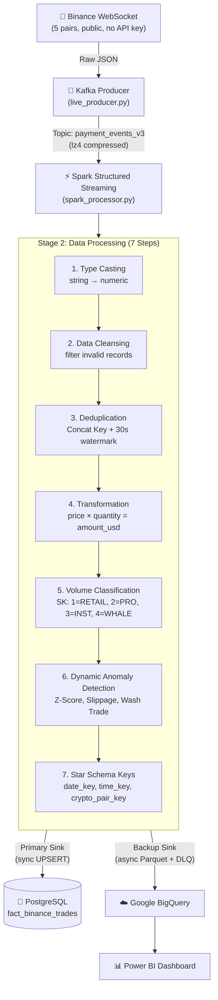
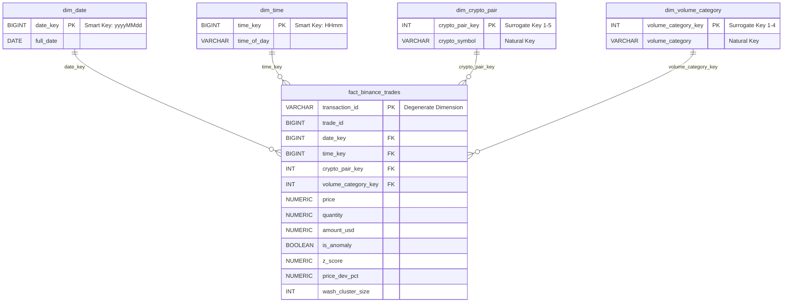

# Real-time Crypto Data Pipeline: Binance Trade Analysis & Anomaly Detection

A real-time streaming data pipeline for cryptocurrency market data, built on **Kimball Star Schema** methodology. The system ingests live trade data from Binance WebSocket, processes it through Apache Spark Structured Streaming with a 7-step transformation pipeline, applies dynamic statistical anomaly detection, and stores results in a dual-sink architecture (PostgreSQL + Google BigQuery).

---

## 📊 Dashboards & Analytics

*(PowerBI Visualizations powered by BigQuery Data Warehouse)*

### 1. Thanh Khoản & Dòng Tiền (Liquidity & Cash Flow)


### 2. Hành Vi Cá Mập (Whale Behavior)


### 3. Cảnh Báo Rủi Ro & Bất Thường (Risk & Anomaly Warnings)


### 4. Phát Hiện BOT Thao Túng (Wash Trade / Bot Manipulation)


### 5. Hiệu Năng Pipeline (Pipeline Performance & Latency)


---

## 🏗 Architecture



---

## ⚙ Data Processing Pipeline (7 Steps)

All processing is performed in **Spark Structured Streaming** (`spark_processor.py`).

| Step | Operation | Description |
|------|-----------|-------------|
| 1 | Type Casting | Convert Binance string fields (price, quantity) to numeric types. |
| 2 | Data Cleansing | Filter invalid records (price ≤ 0, quantity ≤ 0, nulls). |
| 3 | Deduplication | Concat crypto_symbol_trade_id + 30-second watermark + dropDuplicates. |
| 4 | Transformation | Calculate amount_usd = price × quantity. |
| 5 | Volume Classification | Map amount_usd → Surrogate Key (1=RETAIL, 2=PRO, 3=INSTITUTIONAL, 4=WHALE). |
| 6 | Anomaly Detection | Dynamic evaluation via foreachBatch using Window functions (Z-score, Wash trade clustering, Slippage). |
| 7 | Star Schema Keys | Generate date_key (yyyyMMdd), time_key (HHmm), and lookup crypto_pair_key. |

### Two-Layer Deduplication Strategy

1. **Layer 1 (Real-time in Spark):** String concatenation (`crypto_symbol` + `_` + `trade_id`) + 30-second watermark window to handle immediate WebSocket reconnect replays.
2. **Layer 2 (Storage-level):** PostgreSQL `INSERT ... ON CONFLICT (transaction_id) DO UPDATE` guarantees 100% deduplication even if duplicates arrive past the 30-second window.

### Dynamic Anomaly Detection Rules (foreachBatch)

Instead of static thresholds, the pipeline uses statistical Window functions per micro-batch:

- **Z-Score Outlier:** `z_score > 3.0` (Trade amount exceeds 3 standard deviations from the micro-batch mean for that symbol).
- **Wash Trade Bot:** `wash_cluster_size >= 4` (High-frequency sameness: 4+ trades occurring at the exact same millisecond timestamp).
- **Price Slippage:** `price_dev_pct > 0.01 & amount_usd > batch_mean` (Price deviates more than 1% from the batch average while having above-average volume).

---

## 🗄 Kimball Star Schema

The data warehouse follows **Kimball's Dimensional Modeling** methodology with **integer surrogate keys** for all dimension tables.



---

## 🔄 Dual-Sink Storage with Fault Tolerance

| Feature | PostgreSQL (Primary) | BigQuery (Backup) |
|---------|---------------------|-------------------|
| Mode | Synchronous | Asynchronous (buffered) |
| Write Method | UPSERT via psycopg2 execute_values | Parquet Load Job via google-cloud-bigquery |
| Dedup | ON CONFLICT (transaction_id) DO UPDATE | WRITE_APPEND (periodic dedup if needed) |
| Failure Handling | Transaction rollback | DLQ (Dead-Letter Queue): failed Parquet files moved to dlq_bq_failed/ for manual retry |
| Buffer Strategy | Immediate per micro-batch | Flush every 10 seconds OR 5,000 rows |
| Latency Tracking | Logs to fact_pipeline_latency | Included in DLQ system |

---

## 🚀 How to Run

### Prerequisites

- Python 3.10+
- Docker Desktop running (for PostgreSQL, Kafka, Zookeeper)
- Google Cloud service account JSON for BigQuery (Optional)

### Quick Start

```powershell
# 1. Install dependencies
make install

# 2. Start infrastructure (Kafka + Zookeeper + PostgreSQL)
make start-kafka

# 3. Create Star Schema tables
make setup-pg       # PostgreSQL
make setup-bq       # BigQuery (optional)

# 4. Seed dimension tables
make seed-pg        # PostgreSQL
make seed-bq        # BigQuery (optional)

# 5. Run pipeline (open 2 terminals)
make run-live       # Terminal 1: Binance WebSocket → Kafka
make run-spark      # Terminal 2: Spark Processing → Dual Sink
```

---

## 🛠 Tech Stack

| Technology | Version | Purpose |
|------------|---------|---------|
| Python | 3.10+ | Core language |
| Apache Kafka | Confluent 7.5.0 | Message broker |
| Apache Spark | 3.5.0 | Stream processing engine |
| PostgreSQL | 15 | Primary data warehouse |
| Google BigQuery| — | Backup data warehouse |
| Power BI | — | Visualization layer |
| Docker | — | Container orchestration |

*This project is part of a graduation thesis — Real-time Crypto Data Pipeline with Kimball Star Schema.*