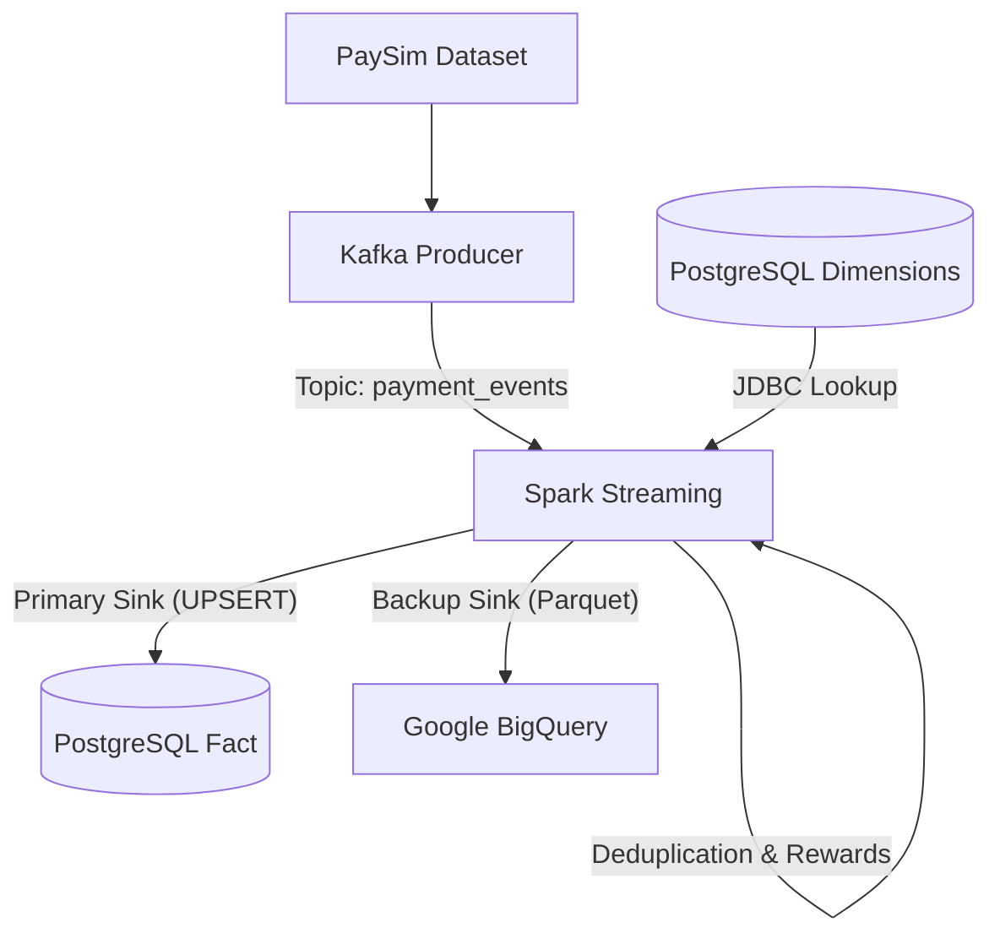

# Real-time Data Pipeline for Fin-tech: Phân tích Giao dịch & Tính điểm Thưởng

Dự án này triển khai một pipeline dữ liệu thời gian thực cho lĩnh vực Fin-tech, tập trung vào việc xử lý các giao dịch thanh toán (PaySim), kiểm soát trùng lặp (Deduplication), làm giàu dữ liệu (Data Enrichment) và tính toán điểm thưởng (Reward Points) tự động.

---

## 🏗️ Kiến trúc Hệ thống (Architecture)

Hệ thống được thiết kế theo mô hình **Lambda Architecture** (phần Speed Layer) với các thành phần chính:

1.  **Data Source (Core Banking Simulation)**: Sử dụng kịch bản Python (`kafka_producer.py`) đọc dataset PaySim để đẩy luồng giao dịch vào Kafka.
2.  **Message Broker**: **Apache Kafka** đóng vai trò là lớp đệm (buffer) cho dữ liệu streaming.
3.  **Stream Processing**: **Apache Spark Structured Streaming** thực hiện:
    *   Khử trùng lặp giao dịch (Deduplication) dựa trên `transaction_id` và `Watermark`.
    *   Tích hợp dữ liệu tĩnh (Stream-Static Join) từ PostgreSQL để lấy hạng thành viên và hệ số thưởng.
    *   Tính toán điểm thưởng theo logic nghiệp vụ phức tạp.
4.  **Data Warehouse (Star Schema)**: **PostgreSQL** lưu trữ dữ liệu đã xử lý phục vụ báo cáo và Dashboard.
5.  **Backup Sink**: Hỗ trợ ghi dữ liệu ra định dạng Parquet để nạp vào **Google BigQuery**.



---

## ✨ Tính năng Nổi bật

*   **Kiểm soát Trùng lặp (Deduplication)**: Sử dụng cơ chế `withWatermark` và `dropDuplicates` của Spark để loại bỏ các giao dịch bị lặp lại trong vòng 5 phút (có test bằng Fault Injection 10% dữ liệu trùng).
*   **Làm giàu dữ liệu thời gian thực (Real-time Enrichment)**: Thực hiện Join luồng Stream với các bảng Dim tĩnh trong PostgreSQL để lấy thông tin khách hàng mà không cần dữ liệu phải có sẵn trong Kafka payload.
*   **Logic Điểm thưởng Nâng cao**: 
    *   `Reward = Amount * Multiplier(TransactionType) * Multiplier(UserTier)`
    *   Hạng Diamond: x2.0, Gold: x1.5, Standard: x1.0.
*   **Tối ưu hóa trên Windows**: Cấu hình sẵn môi trường Spark chạy trên Windows (Winutils, SPARK_LOCAL_IP, Memory tuning 3GB).
*   **Cơ chế Ghi Idempotent**: Sử dụng kỹ thuật UPSERT (INSERT ... ON CONFLICT) qua bảng Staging để đảm bảo dữ liệu không bị sai lệch khi Job Spark khởi động lại.

---

## 📊 Mô hình Dữ liệu (Star Schema)

Hiện tại hệ thống hỗ trợ 9 bảng để phân tích chuyên sâu:

*   **Fact Table**: `fact_transactions` (Lưu vết giao dịch + Điểm thưởng).
*   **Dimension Tables**:
    *   `dim_users`: Thông tin người dùng và phân hạng.
    *   `dim_account`: Thông tin tài khoản (Debit, Credit, E-Wallet).
    *   `dim_merchants`: Thông tin đơn vị chấp nhận thanh toán.
    *   `dim_transaction_type`: Các loại giao dịch và hệ số điểm thưởng tương ứng.
    *   `dim_location`: Thông tin địa lý (Tỉnh/Thành Việt Nam).
    *   `dim_date`: Phân tích theo Ngày/Tháng/Quý/Năm.
    *   `dim_time`: Phân tích theo Giờ/Phút/Khung giờ (Sáng, Trưa, Chiều, Tối).
    *   `dim_channel`: Kênh giao dịch (App iOS, Android, Web, ATM, POS).

---

## 🚀 Hướng dẫn Chạy Hệ thống

### 1. Khởi động hạ tầng
```powershell
docker-compose up -d
```

### 2. Cấu hình Database & Seed dữ liệu
```powershell
# Chạy script tạo bảng
python warehouse/postgres_schema.py

# Nạp dữ liệu danh mục mẫu
python warehouse/seed_dimensions_pg.py
```

### 3. Chạy Pipeline
Mở 2 Terminal:
*   **Terminal 1 (Spark)**: `python processor/spark_processor.py`
*   **Terminal 2 (Producer)**: `python producer/kafka_producer.py` (batch lịch sử)

### 4. Chạy Demo Real-time
Mở 2 Terminal:
*   **Terminal 1 (Spark)**: `python processor/spark_processor.py`
*   **Terminal 2 (Live Producer)**: `python producer/live_producer.py` (giao dịch liên tục)

---

## 🛠️ Xử lý lỗi thường gặp (Troubleshooting)

1.  **Lỗi Winutils (Hadoop)**: Đã cấu hình `HADOOP_HOME` trỏ về `C:\hadoop`. Nếu mất file, hãy tải lại `winutils.exe` cho Hadoop 3.2.2.
2.  **Lỗi OutOfMemory**: Spark Session đã được nâng cấp lên 3GB RAM. Đảm bảo máy tính còn trống tối thiểu 4GB RAM khi chạy.
3.  **Lỗi ConnectionReset (Py4J)**: Thường do lỗi Hostname trên Windows, đã xử lý bằng lệnh `os.environ["SPARK_LOCAL_IP"] = "127.0.0.1"`.
4.  **Lỗi Foreign Key Violation**: Đảm bảo chạy `python warehouse/seed_dimensions_pg.py` trước khi chạy Pipeline để nạp đầy đủ dữ liệu Dimension Tables.

---
*Dự án thuộc khuôn khổ đồ án KLTN - ToMoiChoi/PaySim-Kafka-Data-Ingestion-Pipeline*
