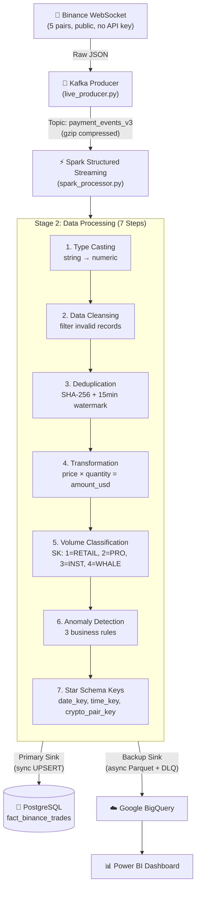
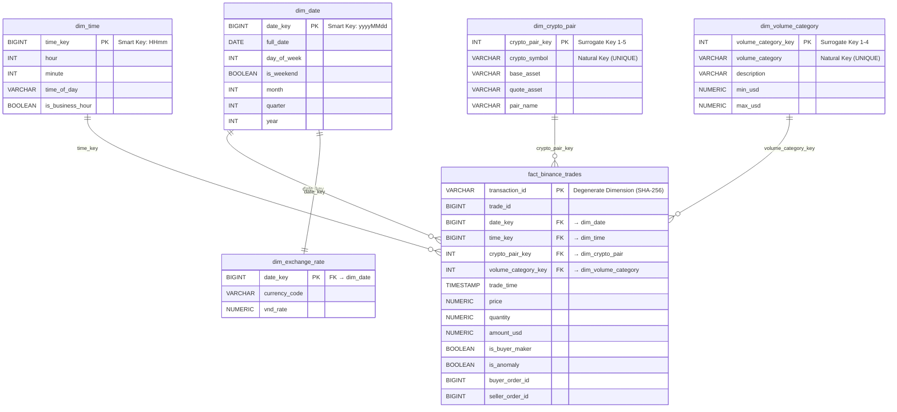

# Real-time Crypto Data Pipeline: Binance Trade Analysis & Anomaly Detection

A real-time streaming data pipeline for cryptocurrency market data, built on **Kimball Star Schema** methodology. The system ingests live trade data from Binance WebSocket, processes it through Apache Spark Structured Streaming with a 7-step transformation pipeline, and stores results in a dual-sink architecture (PostgreSQL + Google BigQuery).

---

## Architecture



### Pipeline Components

| Layer | Component | Role |
|-------|-----------|------|
| **Ingestion** | `live_producer.py` | Binance WebSocket → Kafka (raw data only, no business logic) |
| **Message Broker** | Apache Kafka (Confluent 7.5) | Buffer layer with gzip compression |
| **Processing** | Spark Structured Streaming | 7-step transformation pipeline (the core engine) |
| **Primary Sink** | PostgreSQL 15 | Real-time UPSERT via `ON CONFLICT` |
| **Backup Sink** | Google BigQuery | Async Parquet Load Job with DLQ fault tolerance |
| **Visualization** | Power BI | Connects to BigQuery for dashboards |

---

## Kimball Star Schema

The data warehouse follows **Kimball's Dimensional Modeling** methodology with **integer surrogate keys** for all dimension tables.

### Schema Diagram



### Kimball Compliance

| Principle | Implementation |
|-----------|---------------|
| **Surrogate Keys** | `dim_crypto_pair` PK = `crypto_pair_key INTEGER` (1-5), `dim_volume_category` PK = `volume_category_key INTEGER` (1-4) |
| **Smart Keys** | `dim_date` PK = `date_key BIGINT` (yyyyMMdd), `dim_time` PK = `time_key BIGINT` (HHmm) |
| **No VARCHAR FK in Fact** | Fact table references dimensions via INTEGER keys only. Natural keys (`crypto_symbol`, `volume_category`) stored only as attributes in dimension tables |
| **Degenerate Dimension** | `transaction_id` (SHA-256 hash) lives in Fact table directly — no separate dimension table needed |

### Surrogate Key Mappings

| dim_crypto_pair | dim_volume_category |
|-----------------|---------------------|
| 1 = BTCUSDT | 1 = RETAIL (< $10K) |
| 2 = ETHUSDT | 2 = PROFESSIONAL ($10K–$100K) |
| 3 = BNBUSDT | 3 = INSTITUTIONAL ($100K–$1M) |
| 4 = SOLUSDT | 4 = WHALE (≥ $1M) |
| 5 = XRPUSDT | |

---

## Data Processing Pipeline (7 Steps)

All processing is performed in **Spark Structured Streaming** (`spark_processor.py`):

| Step | Operation | Description |
|------|-----------|-------------|
| 1 | **Type Casting** | Convert Binance string fields (`price`, `quantity`) to numeric types |
| 2 | **Data Cleansing** | Filter records with `price ≤ 0`, `quantity ≤ 0`, nulls |
| 3 | **Deduplication** | SHA-256 deterministic `transaction_id` + 15-minute watermark + `dropDuplicates` |
| 4 | **Transformation** | Calculate `amount_usd = price × quantity` |
| 5 | **Volume Classification** | Map `amount_usd` → surrogate key (1=RETAIL, 2=PRO, 3=INSTITUTIONAL, 4=WHALE) |
| 6 | **Anomaly Detection** | Flag trades matching any of 3 rules: whale trade (≥$1M), dust trade (<$0.01), abnormal quantity per symbol |
| 7 | **Star Schema Keys** | Generate `date_key` (yyyyMMdd), `time_key` (HHmm), lookup `crypto_pair_key` (1-5) |

### Two-Layer Deduplication Strategy

| Layer | Where | Mechanism | Coverage |
|-------|-------|-----------|----------|
| **Layer 1** | Spark (real-time) | SHA-256 hash of `trade_id` + 15-minute watermark + `dropDuplicates` | ~95% of duplicates |
| **Layer 2** | PostgreSQL (storage) | `INSERT ... ON CONFLICT (transaction_id) DO UPDATE` | 100% guaranteed — catches any late arrivals beyond 15 minutes |

### Anomaly Detection Rules

| Rule | Condition | Rationale |
|------|-----------|-----------|
| **Whale Trade** | `amount_usd ≥ $1,000,000` | Market-moving orders (Whale Alert standard) |
| **Dust/Wash Trade** | `amount_usd < $0.01` | Suspected wash trading or address poisoning |
| **Abnormal Quantity** | Per-symbol 99th percentile threshold (e.g., ≥10 BTC, ≥100 ETH, ≥500 BNB, ≥5000 SOL, ≥500K XRP) | OTC block trades or coordinated market activity |

---

## Dual-Sink Storage with Fault Tolerance

| Feature | PostgreSQL (Primary) | BigQuery (Backup) |
|---------|---------------------|-------------------|
| **Mode** | Synchronous | Asynchronous (buffered) |
| **Write Method** | `UPSERT` via psycopg2 `execute_values` | Parquet Load Job via `google-cloud-bigquery` |
| **Dedup** | `ON CONFLICT (transaction_id) DO UPDATE` | `WRITE_APPEND` (periodic dedup if needed) |
| **Failure Handling** | Transaction rollback | **DLQ (Dead-Letter Queue)**: failed Parquet files moved to `dlq_bq_failed/` for manual retry |
| **Buffer Strategy** | Immediate per micro-batch | Flush every 10 seconds OR 5,000 rows |

---

## How to Run

### Prerequisites

- Python 3.10+
- Docker Desktop running
- (Optional) Google Cloud service account JSON for BigQuery

### Quick Start

```powershell
# 1. Install dependencies
make install

# 2. Start infrastructure (Kafka + Zookeeper + PostgreSQL)
make start-kafka

# 3. Create Star Schema tables
make setup-pg       # PostgreSQL
make setup-bq       # BigQuery (optional)

# 4. Seed dimension tables
make seed-pg        # PostgreSQL
make seed-bq        # BigQuery (optional)

# 5. Run pipeline (open 2 terminals)
make run-live       # Terminal 1: Binance WebSocket → Kafka
make run-spark      # Terminal 2: Spark Processing → Dual Sink

# 6. Verify data
make check-db       # Query PostgreSQL fact table
make reconcile      # Compare Kafka vs BigQuery row counts
```

### All Make Targets

| Category | Command | Description |
|----------|---------|-------------|
| **Setup** | `make install` | Install Python dependencies |
| | `make setup-pg` | Create PostgreSQL Star Schema |
| | `make setup-bq` | Create BigQuery dataset & tables |
| | `make seed-pg` | Seed dimension tables (PostgreSQL) |
| | `make seed-bq` | Seed dimension tables (BigQuery) |
| **Infrastructure** | `make start-kafka` | Start Kafka + Zookeeper containers |
| | `make stop-kafka` | Stop all containers |
| | `make logs` | Tail Kafka container logs |
| **Pipeline** | `make run-live` | Start Binance WebSocket producer |
| | `make run-spark` | Start Spark processor (local) |
| | `make run-spark-docker` | Start Spark processor (Docker) |
| **Verification** | `make check-db` | Query PostgreSQL data |
| | `make reconcile` | Compare Kafka vs BigQuery counts |
| **Sync** | `make upload-bq` | Sync PostgreSQL data to BigQuery |
| **Cleanup** | `make clean` | Remove caches and checkpoints |

---

## Project Structure

```
├── producer/
│   └── live_producer.py          # Binance WebSocket → Kafka (ingestion only)
├── processor/
│   └── spark_processor.py        # Spark 7-step processing engine (dual sink)
├── warehouse/
│   ├── postgres_schema.py        # PostgreSQL DDL (Kimball Star Schema)
│   ├── bigquery_schema.py        # BigQuery DDL (Kimball Star Schema)
│   ├── seed_dimensions_pg.py     # Seed dim tables to PostgreSQL
│   └── seed_dimensions_bq.py     # Seed dim tables to BigQuery
├── scripts/
│   ├── migrate_to_kimball_sk.py  # One-time migration: VARCHAR PK → INTEGER SK
│   ├── check_pg_data.py          # Query PostgreSQL for verification
│   └── pg_to_bq_sync.py         # Sync PostgreSQL → BigQuery
├── docker-compose.yml            # Kafka, Zookeeper, PostgreSQL, Spark
├── Dockerfile.spark              # Spark container configuration
├── Makefile                      # All project commands
├── requirements.txt              # Python dependencies
└── .env                          # Environment configuration
```

---

## Troubleshooting

| Issue | Solution |
|-------|----------|
| **Winutils/Hadoop error on Windows** | Ensure `C:\hadoop\bin\winutils.exe` exists. Spark auto-configures the path. |
| **ConnectionReset / Hostname binding** | Windows DNS issue. `spark_processor.py` binds to `SPARK_LOCAL_IP=127.0.0.1`. |
| **Kafka connection timeout** | Kafka needs ~10s after start. Run `make logs` to check status. |
| **BigQuery upload error** | Verify `GOOGLE_APPLICATION_CREDENTIALS` path in `.env`. Failed uploads saved to DLQ. |
| **Py4J NullPointerException** | `spark.driver.host` and `spark.driver.bindAddress` are set to `127.0.0.1`. |

---

## Tech Stack

| Technology | Version | Purpose |
|------------|---------|---------|
| Python | 3.10+ | Core language |
| Apache Kafka | Confluent 7.5.0 | Message broker |
| Apache Spark | 3.5.0 | Stream processing engine |
| PostgreSQL | 15 | Primary data warehouse |
| Google BigQuery | — | Backup data warehouse |
| Power BI | — | Visualization layer |
| Docker | — | Container orchestration |

---

*This project is part of a graduation thesis — Real-time Crypto Data Pipeline with Kimball Star Schema.*
